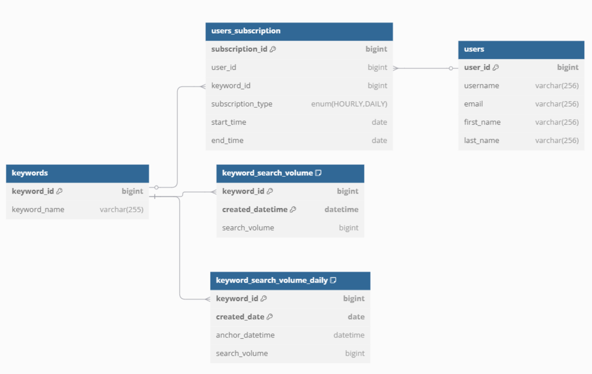

# EPSILO INTERVIEW TEST

## Table of Contents
1. [Requirements Clarification](#requirements-clarification)
2. [Database Modelling](#database-modelling)
3. [Problem Solution](#problem-solution)
   - [Database and Sample Data](#database-and-sample-data)
   - [Users Subscription Scenarios](#users-subscription-scenarios)
   - [HTTP Service Implementation](#http-service-implementation)
     - [Request Parameters](#request-parameters)
     - [Response Format](#response-format)
   - [Query Processing Flow](#query-processing-flow)
4. [Test Cases Scenarios](#test-cases-scenarios)
5. [Running Unit Test Instructions](#running-unit-test-instructions)
   - [Prerequisites](#prerequisites)
   - [Install Required Packages](#install-required-packages)
   - [Config `config.yml`](#config-configyml)
   - [Initialize Database Schema and Insert Sample Data](#initialize-database-schema-and-insert-sample-data)
   - [Run Unit Tests](#run-unit-tests)
   - [Run Flask HTTP Server to Get Query Data](#run-flask-http-server-to-get-query-data)
6. [Overcome Challenges](#overcome-challenges)
7. [Not Overcome Challenges](#not-overcome-challenges)

## Requirements Clarification
- Search Volume service will gather data for different keywords every hour. Each data point is timestamped in the format `yyyy-MM-dd HH:00:00` (e.g., `2023-10-15 14:00:00`).
- Daily data is a specific snapshot of the search volume, recorded at or near `9:00 AM` each day. If no data exists exactly at `9:00 AM`, the service uses the nearest available hourly data point from that day.
- Users can query search volume data for any keyword over a specified time range, choosing either:
    - `Hourly data`: All hourly records within the range.
    - `Daily data`: Only the daily snapshots (at or near `9:00 AM`) within the range.
- Users can subscribe to receive updates on a keyword’s search volume, with two subscription types:
    - `Daily Subscription`: Users get updates only for the daily snapshot (at or near 9:08 AM). They do not receive hourly data.
    - `Hourly Subscription`: Users get updates for every hourly data point, which naturally includes the daily snapshot since it’s part of the hourly records.
- Users can subscribe to the overlap timeline of a keyword and will see the union range of them.

## Database Modelling


- `users` Table:
    - Stores basic user details, use for users management.
- `keywords` Table:
    - Stores keyword information, used as a reference for subscriptions and search volumes.
- `users_subscription` Table:
    - Links users to keywords they subscribe to and specifies subscription type, including subscription time range (`start_time` and `end_time`).
    - Supports the use case of users subscribing hourly or daily to specific keywords.
- `keyword_search_volume` Table:
    - Stores hourly search volume data for keywords.
- `keyword_search_volume_daily` Table:
    - Stores daily search volume data, anchored to 9:00 AM or the nearest available time.

## Problem Solution
### Database and Sample data

- To address the requirements of the problem, a database with the above design is used. Scripts for creating the database schema and corresponding relations are located in the file `sql/init_schema.sql`.

- In the case of `Daily Subscription`, data can be directly aggregated (`on-the-fly`) from the `keyword_search_volume` table. However, we should create a separate table `keyword_search_volume_daily` for this use case. Creating a separate table for the `Daily` case will improve query performance since there is no need to process data every time a query is executed, and it also makes it easier to track `anchor_time` timestamps taken from the `keyword_search_volume` table.

- Data in the `keyword_search_volume_daily` table will be aggregated from the `keyword_search_volume` table based on the `09:00 AM` snapshot or the nearest available time. There are two ways to implement this:
    - Processing directly in MySQL by writing a `procedure` and setting up a schedule. This approach is also used in the test (`sql/procedure.sql`).
    - Using an ETL process.

- Sample data for 10 keywords over a period of 3 months and subscription examples are automatically generated from the `generated_data.py` file. The file also includes cases with noise for situations where the data at 09:00 AM (used as the daily snapshot) is missing.

### Users Subscription Scenarios
- Below are some possible user subscription scenarios:
    - `Hourly Subscription for a Single Keyword`, with both overlapping and non-overlapping subscription times..
    - `Daily Subscription for a Single Keyword`, with both overlapping and non-overlapping subscription times..
    - `Hourly Subscription for Multiple Keywords`, with both overlapping and non-overlapping subscription times..
    - `Daily Subscription for Multiple Keywords`, with both overlapping and non-overlapping subscription times.
    - `Hourly and Daily Subscription for the Same Keyword`, including cases where DAILY and HOURLY subscriptions overlap.
    - `Hourly and Daily Subscription for the Multiple Keywords`, including cases where DAILY and HOURLY subscriptions overlap.

### HTTP Service Implementation
- For the HTTP Service, since `Python` is used as the programming language, the framework chosen for the HTTP Service is `Flask`.

#### Request Parameters:

| Parameter   | Type                      | Required | Description |
|------------|---------------------------|----------|-------------|
| `user_id`  | integer                   | Yes        | The unique identifier of the user. |
| `keywords_id` | string (comma-separated)  | Yes        | List of keywords_id (e.g., `1,2,3`). |
| `timing`   | string                     | Yes        | Specifies **hourly** or **daily** search volume. Accepted values: `"HOURLY"`, `"DAILY"`. |
| `start_time` | integer       | Yes        | Start unix timestamp (e.g., `1736640000`). |
| `end_time`   | integer       | Yes        | End unix timestamp (e.g., `1736899200`). |

#### Response Format:
- Content-Type: `application/json`
- `200 Success` - Success Response
```
{
    "message": "Query executed successfully",
    "success": "True",
    "search_volume": [
        {
            "data": [
                {
                    "CREATED_DATE": "2025-01-05T00:00:00",
                    "SEARCH_VOLUME": 3854
                },
                {
                    "CREATED_DATE": "2025-01-06T00:00:00",
                    "SEARCH_VOLUME": 1528
                },
                {
                    "CREATED_DATE": "2025-01-07T00:00:00",
                    "SEARCH_VOLUME": 326
                }
            ],
            "error": "False",
            "keyword_id": 2,
            "keyword_name": "fireplace mantel",
            "status": "Successful"
        },
        {
            "data": [
                {
                    "CREATED_DATE": "2025-01-05T00:00:00",
                    "SEARCH_VOLUME": 934
                },
                {
                    "CREATED_DATE": "2025-01-06T00:00:00",
                    "SEARCH_VOLUME": 2264
                },
                {
                    "CREATED_DATE": "2025-01-07T00:00:00",
                    "SEARCH_VOLUME": 1887
                }
            ],
            "error": "False",
            "keyword_id": 4,
            "keyword_name": "butcher block countertop",
            "status": "Successful"
        }
    ]
}
```

- `400 Bad Request` - Required parameters are missing or invalid.
```
{
    "errors": "Missing required fields start_time.",
    "message": "Validation failed",
    "success": "False"
}
```
- `403 Forbidden` - The user does not have access to the requested keyword data
```
{
    "errors": "User doesn't have any subscriptions with keywords_id 2,4",
    "message": "Unauthorized Users",
    "success": "False"
}
```

### Query processing flow

1. **Validate Input Parameters**  
   - Ensure `user_id`, `keywords_id`, `timing`, `start_time`, and `end_time` are provided and correctly formatted.  

2. **Verify User Subscription for Requested Keywords**  
   - If the user doesn't have an active subscription for any of the requested keywords, return `403 Forbidden`.  
   - If the user has a subscription, proceed to the next step.  

3. **Validate Subscription Permissions and Time Range**  
   - Ensure the user has the appropriate `DAILY` or `HOURLY` data subscription.  
   - Check that the requested `start_time` and `end_time` fall within the user's subscription period (`start_time` and `end_time` in `user_subscription` table). If either timestamp is out of range, the request is considered invalid.  
   - Handle cases where subscription timelines overlap.  

4. **Query and Return Data**  
   - If the subscription is valid, fetch the requested data and return it in `JSON` format.  

### Test Cases Scenarios 
All unit tests are located in the `unittest/search_vols_unit_test.py` file, including 31 test cases. These tests cover various scenarios for unit testing methods within `SearchVolumeService` (`services/search_vols.py`) and all possible user subscription cases, including:

- **Input Validation Tests**:
    - Check for missing required fields in input parameters.
    - Validate subscription type (`HOURLY`, `DAILY`).
    - Ensure correct data formats.

- **No/Insufficient Subscription**:
    - Test cases where users lack subscription permissions for the requested keyword.
    - Verify that users with a **DAILY** subscription cannot query **HOURLY** data.

- **User Subscription Scenarios**:
    - Validate both valid and invalid queries for overlapping and non-overlapping subscription times.
    - Test queries with multiple keywords, including cases where some keywords are valid while others are not within the same request.
    - Handle queries where HOURLY and DAILY subscription times overlap.

All data used for unit testing consists of sample data generated by `generated_data.py`.

## Running Unit Test Instructions
### Prerequisites 
- Create or connect to a MySQL instance. If creating a new instance, you can initialize MySQL using `Docker` (you may customize parameters like `MYSQL_DATABASE`, `MYSQL_USER`, `MYSQL_PASSWORD`, etc., as needed). 
```
# Start MySQL database
docker compse up -d --build
```
- Install Python or set up a Conda Virtual Environment.

### Install Required Packages
```
pip install -r requirements.txt
```
### Config `config.yml`
```
# Create `config.yml` file at root level
MYSQL_CONNECT:
  USERNAME: <username>
  PASSWORD: <password>
  HOST: localhost
  PORT: 3306
  DATABASE: search_term_db
```

### Initialize Database Schema and Insert Sample Data
```
python generated_data.py
```

### Run Unit Tests
```
python -m unittest unit_tests/search_vols_unit_test.py 
```

### Run Flask HTTP Server to get query data
```
# Flask app at localhost:5000
python app.py 
```

## Overcome Challenges
- Designed a data model to address the given requirements.
- Implemented DAILY data aggregation from HOURLY data using a stored procedure in MySQL, handling exceptions such as missing `09:00` data by replacing it with the nearest available snapshot.
- Resolved user subscription problems, including:
    - Users subscribed to **DAILY** data cannot access **HOURLY** data, while users subscribed to **HOURLY** data can access **DAILY** data.
    - Handling overlapping subscription periods.
    - Supporting queries with multiple keywords, ensuring that each keyword meets the necessary subscription requirements within the same query.

## Not Overcome Challenges
- When the `keyword_search_volume` have very large volumes (hundreds of millions of records) and the number of users increases (millions of users), advanced optimization techniques such as **indexing, partitioning, and caching** are required to enhance query performance and efficiently aggregate data into the `keyword_search_volume_daily` table.

- More flexible query time handling based on user subscription periods for each keyword. Example:
    - User's subscription period: `2025/01/05 - 2025/01/15`
    - User queries with `start_time='2025/01/01'` and `end_time='2025/01/10'`.
    - Instead of raising a `subscription error` like current implementation, return data from `2025/01/05 - 2025/01/10`, aligning with the user's valid subscription period.

